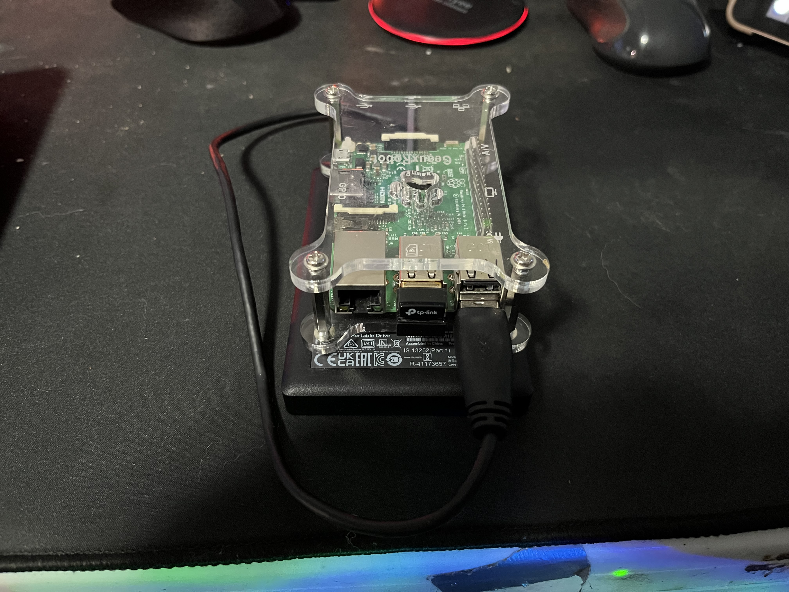
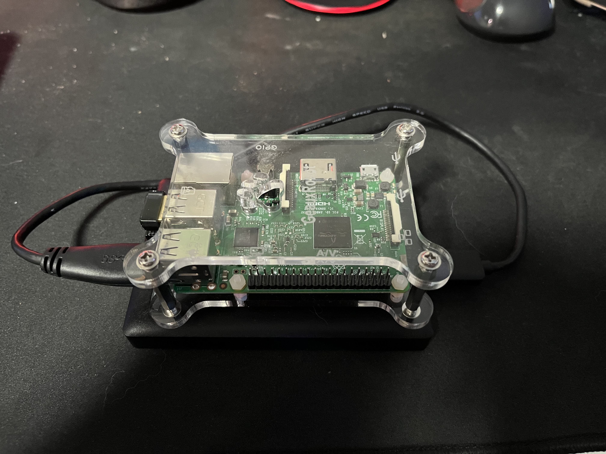

# Kodi Pi3 - LibreElec image
## Finished Product:


## Software/Hardware:
* Kodi via LibreElec
* Wireless Network AP {{ssid:mobile}} - [Amazon Link](https://www.amazon.com/dp/B008IFXQFU?psc=1&ref=ppx_yo2ov_dt_b_product_details)
* DLNA via kodi - miniDNLA under the hood
* 2TB external HD - media (movies/tv)
## Repos
* [releases](https://github.com/teksider/portable_meda_center/releases/tag/kodi)
*  [latest](https://github.com/teksider/portable_meda_center/releases/download/kodi/20220707035213.tar)                    

## Initial Config
Write LibreElec img to flash media following this guide: [GUIDE](https://wiki.libreelec.tv/installation/create-media)
[Raspberry Pi Downloads](https://libreelec.tv/downloads/raspberry/)
### Install

The “LibreELEC USB-SD Creator” app helps you choose and download the latest image for your HTPC device and create bootable USB or SD Card media. The tool is available for Windows XP and newer, macOS 10.9 and newer, and Ubuntu Linux 32/64 bit (and should also work on other Debian derivatives).

* [LibreELEC.USB-SD.Creator.Win32.exe](http://releases.libreelec.tv/LibreELEC.USB-SD.Creator.Win32.exe)
* [LibreELEC.USB-SD.Creator.macOS.dmg](http://releases.libreelec.tv/LibreELEC.USB-SD.Creator.macOS.dmg)
* [LibreELEC.USB-SD.Creator.Linux-32bit.bin](http://releases.libreelec.tv/LibreELEC.USB-SD.Creator.Linux-32bit.bin)
* [LibreELEC.USB-SD.Creator.Linux-64bit.bin](http://releases.libreelec.tv/LibreELEC.USB-SD.Creator.Linux-64bit.bin)

#### Step 1

Choose the LibreELEC image and the app will show the latest stable release, e.g.

* Generic x86_64 - LibreELEC-Generic.x86_64-9.2.6.img.gz
* RaspberryPi 0/1 - LibreELEC-RPi.arm-9.2.6.img.gz
* RaspberryPi 2/3 - LibreELEC-RPi2.arm-9.2.6.img.gz
* RaspberryPi 4 - LibreELEC-RPi4.arm-9.2.6.img.gz

If you check 'Show all' the list also shows older stable releases and current Alpha (x.90.xxx) or Beta (x.95.0) releases.

#### Step 2

After selecting the LibreELEC image and version click the `Download` button. This will prompt you to select a folder to download to. You can also select a previously downloaded image file on your machine for installation. Hit the `Select file` button and browse your computer for the .img.gz file, or drag/drop the file on the app GUI.

#### Step 3

Select the USB stick or SD card to write the image onto. Click the refresh button if the removable device is not listed. Note: **ALL DATA ON THE TARGET DEVICE WILL BE OVERWRITTEN** so please ensure there is no important data on it!

#### Step 4

After selecting an image and target device the `Write` button is available. Click it to write the image. Once the progress bar reaches 100% and shows `Writing done!` you can exit the app, eject the USB or SD media, and boot your device to install LibreELEC.

#### Support

If you experience problems with the app, please post in the [USB-SD Creator Support forum](https://forum.libreelec.tv/forum-41.html).

## Boot into kodi and restore backup file 
restore via UI or:
```
tar -xvf /path/to/your/backupfile.tar.gz -C /storage
```
## Extras 
### Manual backup steps - using dd
Create image with current date
```bash
sudo dd bs=4M if=/dev/mmcblk0 | gzip > /home/tech/backups/pi3_image.`date +%d%m%y`.gz
```